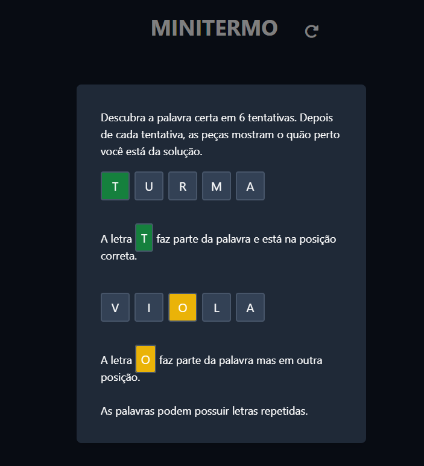
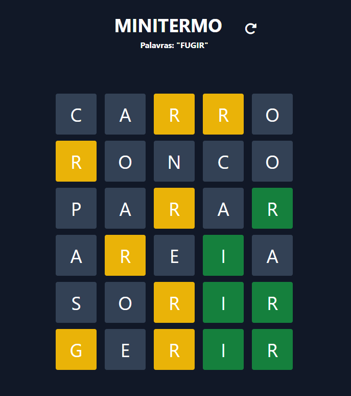

# Mini Termoo

O **Mini Termo** é um jogo divertido onde o objetivo é adivinhar uma palavra de 5 letras em até 6 tentativas. A cada tentativa, o jogo indica quais letras estão corretas e em suas posições certas, quais fazem parte da palavra mas estão em posições diferentes, e quais não aparecem na palavra. Use as dicas para acertar a palavra secreta!

- Letras verdes: estão corretas e na posição certa.
- Letras amarelas: fazem parte da palavra, mas estão em outra posição.
- Letras cinzas: não fazem parte da palavra.

As palavras podem conter letras repetidas. Boa sorte!
